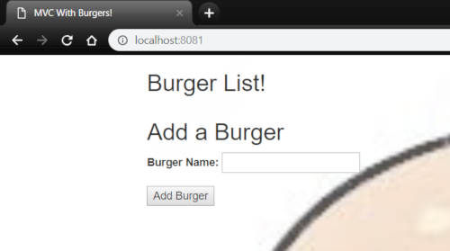
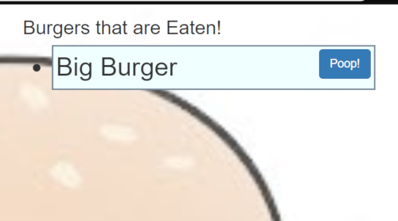

# Burgers!

## Overview

A burger list builder that uses MySQL and Sequelize to input data from the user into a table and then uses Express and Handlebars to render views on an HTML webpage. 

## Directory Layout
```
burger
- config
    - connection.js
    - orm.js
- controllers
    - burger_controller.js
- db
    - schema.sql
    - seeds.sql
- models
    - burger.js
- node_modules
- public
    - assets
        - css
        - images
        - js
            -burgers.js
- views
    - layouts
        - main.handlebars
    - partials
        - burgers
            - burger-block.handlebars
    - index.handlebars
- package.json
- server.js

```

## Setup

1. Clone the Repo: `https://github.com/Malkons/burger.git`
2. Get node.js if you don't already: [https://nodejs.org/en/](https://nodejs.org/en/)
3. In the root of the directory install npm dependencies: `npm i`
4. In the Command Line run: `node server`
5. The server is listing on port 8080. Navigate here in a browser [http://localhost:8080](http://localhost:8080) 

Type in a new burger name and click the add burger button



Click the "Eat!" button to eat the burger


Click the "Poop!" button to delete the burger from the list




